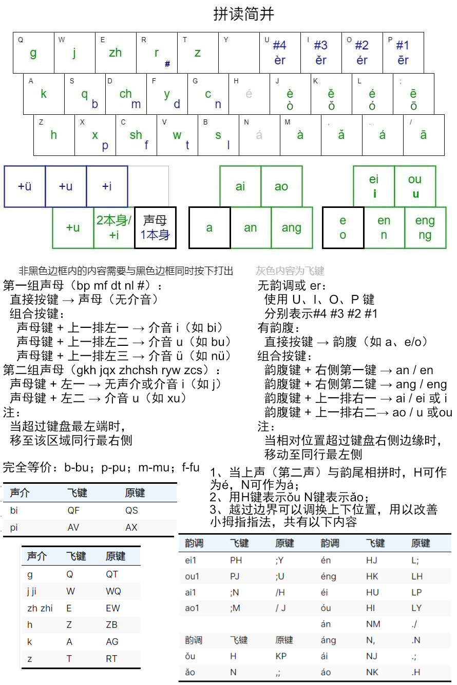

# 拼读简并
拼读并击原始版：[https://github.com/zhanghaozhecn/rime-pindu-chord-type](https://github.com/zhanghaozhecn/rime-pindu-chord-type)

拼读简并原始版：[https://pdbj-simple.netlify.app/](https://pdbj-simple.netlify.app/)

拼读并击简单版，力求避免并击记忆量大，入门困难的缺点，是目前入门最简单，记忆量最小的并击输入法。

## **一、核心设计理念**

1. **简化记忆负担** 通过相对位置法，避免传统并击输入法的记忆量大和入门困难的问题。
2. **高效输入** 高频字与词只需一键（声介）即可打出，词和标点输入也有优化设计，理论文本平均一字需要按键数<1下（理论码长<1)。
3. **思维减压** 作为拼读并击的分支方案，仅使用音进行输入，无思考字形的干扰，所想即所得，适合文字创作。

## 二、拆分规则

将汉字的拼音拆分为两个部分：

（1）声介：声母同随后的 **一个** 介音（i、u、ü） **先** 拼为一个整体，这个整体称为声介。

（2）韵调：剩余部分称为韵调

两者均可为空，用 `#` 表示。后面的数字表示第几声。

示例：

|读音|声介|韵调|
|---|---|---|
|bǎ|b|ǎ|
|zài|z|ài|
|bié|bi|é|
|jiā|ji|ā|
|yuān|yu|ān|
|zhuāng|zhu|āng|
|lüè|lü|è|
|gāo|g|āo|
|bǐ|bi|#3|
|dú|du|#2|
|lǜ|lü|#4|
|yú|yu|#2|
|ào|#|ào|
|éi|#|éi|

**特殊情况处理**
- `ong` / `iong` 改为 `ung`，例如 `xiōng` 拆为 `xu` + `ng`

## **三、键位设计**

键盘分为左右两部分：

- **左侧15键**：输入声介。
- **右侧15键**：输入韵调。

### 1. **声介输入方式**

将声母分为两组，

第一组声母包括bp mf dt nl \#，用蓝色标出，分别位于SX DC FV GB键上

第二组声母包括gkh jqx zhchsh ryw zcs,，用绿色标出，分别位于QAZ WSX EDC RFV TGB上

- **第一组声母**（bp mf dt nl \#）：  
	- 直接按键 → 声母（无介音）。
	- 组合按键：  
		- 声母键 + 上一排左一 → 介音 `i`（如 `bi`）。
		- 声母键 + 上一排左二 → 介音 `u`（如 `bu`）。
		- 声母键 + 上一排左三 → 介音 `ü`（如 `nü`）。
 
- **第二组声母**（gkh jqx zhchsh ryw zcs）：  
	- 声母键 + 左一 → 无声介或介音 `i`（如 `j`）。
	- 声母键 + 左二 → 介音 `u`（如 `xu`）。

示例：以G键上声介为例

|按键|声介|
|---|---|
|G|n|
|GR|ni|
|GE|nu|
|GW|nü|
|GF|c|
|GD|cu|

注：当超过键盘最左端时，移至该区域同行最右侧

### 2. **韵调输入方式**

- **无韵调或** `er`：使用 `U`、`I`、`O`、`P` 键。分别表示#4 #3 #2 #1
- **有韵腹**：
	- 直接按键 → 韵腹（如 a、e/o）。
	- 组合按键：
		- 韵腹键 + 右侧第一键 → `an` / `en`。
		- 韵腹键 + 右侧第二键 → `ang` / `eng`。
		- 韵腹键 + 上一排右一 → `ai` / `ei` 或 `i`。
		- 韵腹键 + 上一排右二→ `ao` / `u` 或`ou`。

注：当相对位置超过键盘右侧边缘时，移动至同行最左侧

## **四、输入方式**

### 1. 单字输入
- **一击字**：仅需打出声介即可上屏，如：的了在是和一这他我等

个**q** 就**w** 这**e** 而**r** 在**t**
看**a** 不**s** 们**d** 的**f** 那**g**
和**z** 跑**x** 法**c** 他**v** 了**b**

过**qr** 如**wr** 句**wt** 中**eq** 人**re** 如**rw** 最**te**
快**af** 其**sa** 去**sg** 成**ds** 出**da** 一**fd** 与**fs** 才**gf** 从**gd** 
或**zv** 小**xz** 学**xb** 是**cx** 说**cz** 我**vc** 三**bv** 所**bc**

并**sq** 不**st** 名**dw** 地**fe** 对**fw** 你**gr** 弄**ge** 女**gw**
批**xa** 从**cs** 条**vd** 同**vs** 两**bf** 路**bd** 率**bs**

- **其余字**：打出声介 + 韵调，再进行选重，与空格同时按下可以一击直接上屏首选。

### 2. 词输入见下面

### 3. 标点输入

| 键位 |  符号   |       键位       |  符号   |
| ---- | ------- | --------------- | ------- |
| J    | ，      | JK              | （      |
| K    | 。      | KL              | ）      |
| L    | ？      | JL              | 《      |
| ;    | ;或二选 | J;              | 》      |
| H    | 、      | UI              | ·       |
| U    | “       | IO              | ～      |
| I    | ”       | UO              | ‘〈【〔 |
| O    | ：      | UP              | ’〉】〕 |
| P    | ；      | M,              |         |
| Y    | ——      | ,.              | ]或下页 |
| M    | ！      | M.              | ¥€£     |
| ,    | ,或三选 | M/              | °℃℉   |
| .    | .或四选 | HK              | 她      |
| /    | /或五选 | HK_（按键+空格） | 像      |
| N    | ……      |                 |         |

其中：

|  按键   | 首选 | 次选（按键+空格） |
| ------ | ---- | ---------------- |
| J      | ，   | ,（英文）         |
| K      | 。   | .（英文）         |
| L      | ？   | ！               |
| ;      | ：   | ；               |

其他键位功能如下：

- { }：翻页
- 退格：有编码时清除所有编码。

[x] 1234567890：只能打数字，有编码时直接顶字词上屏。

## **进阶技巧(可选学习）**

### 声介合并

部分声介之间完全等价。具体如下表所示。

| 声介 | 声介 |
| ---- | ---- |
| b    | bu   |
| p    | pu   |
| m    | mu   |
| f    | fu   |

> fi是不存在的，所以cs空缺；取消ca作为声介fu的按键，ca改为声介cu

### **声介飞键**

由于部分声介组合不太方便按出，为了优化手感，因此设置了另一种额外的打出方式。声介部分共设置了三组飞键

组一 （建议使用）

|声介|飞键|原键|
|---|---|---|
|bi|QF|QS|
|pi|AV|AX|

组二 （建议使用）

| 声介     | 飞键  | 原键  |
| ------ | --- | --- |
| g      | Q   | QT  |
| j ji   | W   | WQ  |
| zh zhi | E   | EW  |
| h      | Z   | ZB  |
| k      | A   | AG  |
| z      | T   | RT  |

组三（按需使用）

将远距离按键映射，规避并击中B G T键的使用

| 声介  |    飞键     | 原按键 |
| ---- | ----------- | ------ |
| l    | AR          | B      |
| li   | AE          | BF     |
| lu   | AW          | BD     |
| z zi | ZF          | TR     |
| zu   | ZD          | TE     |
| c ci | CS(或CD)    | Gf     |
| cu   | CA          | Gd     |
| xi   | XF（或XFV） | XZ     |
| xu   | XD（或XDV） | XB     |
| s si | SR          | VB     |
| su   | SE          | CB     |

组四：由于食指和小指同时按下，无名指悬空，是一个非常难受的动作，所有跨一个按键的组合，都添加3字母并击飞键

| 声介   | 飞键  | 原按键 |
| ---- | --- | --- |
| zhu   | QWE  | EQ   |
| chu   | ASD  | DA  |
| shu   | ZXC  | CZ  |
| ru   | REW  | RW  |
| yu   | FDS  | FS  |
| wu   | VCX  | VX  |
| mi	 | WEF  |   DW  |
| qi	 | SEF  |   SA  |

### 韵调飞键

也设置了三组韵调飞键

组一（建议使用）

越过边界可以调换上下位置，用以改善小拇指指法，共有以下内容

| 韵调 | 飞键 | 原键 |
| ---- | ---- | ---- |
| ei1  | PH   | ;Y   |
| ou1  | PJ   | ;U   |
| ai1  | ;N   | /H   |
| ao1  | ;M   | / J  |

组二（建议使用）

当上声（第二声）与韵尾相拼时，H可作为é，N可作为á

|韵调|飞键|原键|
|---|---|---|
|én|HJ|L;|
|éng|HK|LH|
|éi|HU|LP|
|óu|HI|LY|
|án|NM|./|
|áng|N,|.N|
|ái|NJ|.;|
|áo|NK|.H|

组三 （按需使用）

用H键表示ǒu N键表示ǎo

| 韵调 | 飞键 | 原键 |
| ---- | ---- | ---- |
| ǒu   | H    | KP   |
| ǎo   | N    | ,;   |

组四：由于食指和小指同时按下，无名指悬空，是一个非常难受的动作，所有跨一个按键的组合，都添加3字母并击飞键
另外，由于KO、MK这两个组合的手感也不行，所以也飞键一下

| 韵调  | 飞键 | 原按键 |
| ---- | ---- | ------ |
| eng3 | KL;  | K;     |
| eng4 | LKJ  | LJ     |
| ang3 | ,./  | ,/     |
| ang4 | .,M  | .M    |
| ei3  | JiO  | KO     |
| ai3  | MKL  | MK     |

# 词的打法
## 51个简词

简词只需一击，有51个，由首字的左手声介+_打出，包括：

例如：我们→我→wo→VC→VC_。

> 编码放在pdbj.user.dict.yaml里面

## 一击字 + 一击词对应表

| 按键 | 一击字 | 一击字编码 | 一击词 | 一击词编码 |
| ---- | ------ | ---------- | ------ | ---------- |
| r    | 而     | AZZ        | 而且   | AZa        |
| g    | 那     | BZZ        | 那么   | BZa        |
| sq   | 并     | CZZ        | 并且   | CZa        |
| cz   | 说     | DZZ        | 说明   | DZa        |
| te   | 最     | EZZ        | 最后   | EZa        |
| vd   | 条     | FZZ        | 条件   | FZa        |
| dw   | 名     | GZZ        | 名字   | GZa        |
| da   | 出     | HZZ        | 出现   | HZa        |
| sg   | 去     | IZZ        | 去年   | IZa        |
| bv   | 三     | JZZ        | 三次   | JZa        |
| gr   | 你     | KZZ        | 你们   | KZa        |
| gf   | 才     | LZZ        | 才能   | LZa        |
| vs   | 同     | MZZ        | 同时   | MZa        |
| xb   | 学     | NZZ        | 学习   | NZa        |
| wt   | 句     | OZZ        | 句子   | OZa        |
| bc   | 所     | PZZ        | 所以   | PZa        |
| x    | 跑     | QZZ        | 跑路   | QZa        |
| bd   | 路     | RZZ        | 路线   | RZa        |
| wr   | 如     | SZZ        | 如果   | SZa        |
| af   | 快     | TZZ        | 快速   | TZa        |
| xa   | 批     | UZZ        | 批评   | UZa        |
| cs   | 从     | VZZ        | 从来   | VZa        |
| bs   | 率     | WZZ        | 概率   | WZa        |
| ge   | 弄     | XZZ        | 弄清楚 | XZa        |
| gw   | 女     | YZZ        | 女人   | YZa        |
| f    | 的     | aZZ        | 但是   | aZa        |
| fd   | 一     | bZZ        | 一般   | bZa        |
| cx   | 是     | cZZ        | 什么   | cZa        |
| w    | 就     | dZZ        | 就是   | dZa        |
| e    | 这     | eZZ        | 这个   | eZa        |
| xz   | 小     | fZZ        | 小时   | fZa        |
| vc   | 我     | gZZ        | 我们   | gZa        |
| st   | 不     | hZZ        | 不是   | hZa        |
| t    | 在     | iZZ        | 自己   | iZa        |
| c    | 法     | jZZ        | 法律   | jZa        |
| qr   | 过     | kZZ        | 过程   | kZa        |
| d    | 们     | lZZ        | 没有   | lZa        |
| bf   | 两     | mZZ        | 两者   | mZa        |
| z    | 和     | nZZ        | 还是   | nZa        |
| b    | 了     | oZZ        | 了解   | oZa        |
| sa   | 其     | pZZ        | 其实   | pZa        |
| fs   | 与     | qZZ        | 于是   | qZa        |
| q    | 个     | rZZ        | 个人   | rZa        |
| v    | 他     | sZZ        | 他们   | sZa        |
| zv   | 或     | tZZ        | 或者   | tZa        |
| eq   | 中     | uZZ        | 中国   | uZa        |
| re   | 人     | vZZ        | 人们   | vZa        |
| ds   | 成     | wZZ        | 成为   | wZa        |
| fw   | 对     | xZZ        | 对的   | xZa        |
| fe   | 地     | yZZ        | 地区   | yZa        |
| a    | 看     | zZZ        | 看到   | zZa        |

### 612个一击词

左手第一字声介 + 右手末字首笔（如撇、竖、点等）可一键打出常用词。共612个。

后续可以直接输入其他内容，自动上屏。

左手声介+右手字的第1笔画+ 空格同时打出，可以上屏次选

右手笔画具体如下所示，建议自己加

|  按键   |   笔    | 编码大写 |
| ------ | ------- | -------- |
| UI	 | 横 	一 | S        |
| IO	 | 竖	丨 | T        |
| OP	 | 撇	丿 | U        |
| IP	 | 点	丶 | V        |
| UP	 | 折	乛 | X        |
| UO	 | 人日口   | W       |

例如

|   词   |        按键        |
| ------ | ----------------- |
| 能不能 | G +UP             |
| 看来   | A+UI+空格 直接上屏 |

## 二字以上词
二字词：第一击（字1读音）+ 第二击（字2读音）

多字词：第一击（字1读音） + 第二击（字2读音带空格）+ 第三击（末字读音）

## 辅助码(按需使用）

与拼读并击一样，打出读音后，可追加辅助码筛选，大多数辅助码是形旁的读音，少部分是无理的分布在右侧键盘

“形旁部首码”，只取一个部首，设计的目的是使两音一形的单字选重率最低。主要方法是优先使用形旁，剔除形码中和字音重复的信息（声旁）。本方案中部首被映射到声介和11个无理键位上，共有193个，部首列表见键位映射一节。

> 我把辅助码改成了小鹤的，比拼读并击的原生辅助差，lua和dict同时修改可以改回来

## 键位映射

大部分部首用其读音的声介表示，见**表-左手声介部首**，括号内为附属字形。为了减少重码，把11个部首放在右手单键上，其位置见**表-右手无理部首**。

**左手声介部首**

| 声介  | 部首                | 声介  | 部首                   |
| --- | ----------------- | --- | -------------------- |
| #   | 耳（阝）儿二            | gu  | 弓工廾骨谷瓜广鬼             |
| i   | 羊（𦍌）衣（衤）牙言页业音尢酉又 | k   | 口                    |
| u   | 瓦王韦文              | ku  | 囗冂匚凵                 |
| ü   | 鱼羽雨玉聿             | h   | 禾黑一                  |
| b   | 八（丷）卜（⺊）白勹贝不      | hu  | 虎（虍）火（灬）户            |
| bi  | 鼻匕髟冫疒             | ji  | 卩（㔾）几见角巾金斤臼          |
| p   | 攵（夊）              | qi  | 气欠                   |
| pi  | 皮片丿               | qü  | 犬（犭）                 |
| m   | 马毛矛门母目朩           | xi  | 西（覀）小（⺌）心（㣺）夕香辛行     |
| mi  | 米冖皿               | xü  | 穴彐血                  |
| f   | 方非风缶父             | zh  | 爪（爫）乛支止豸舟            |
| d   | 刀（刂⺈）大歹斗豆         | zhu | 竹隹                   |
| di  | 丶                 | ch  | 厂车齿彳赤                |
| t   | 亠                 | chu | 虫                    |
| ti  | 田                 | sh  | 食（饣）示（礻）手（龵）彡舌身尸十矢豕士 |
| tu  | 土                 | shu | 水（氺）殳鼠丨              |
| ni  | 鸟牛                | r   | 人（入）日（曰）肉            |
| nü  | 女                 | z   | 走（辶廴）子               |
| l   | 老（耂）耒             | zu  | 足                    |
| li  | 力立                | c   | 艹                    |
| lu  | 龙鹿                | cu  | 寸                    |
| g   | 宀戈革鬲              | s   | 四（罒）三糸厶巳             |

**右手无理部首**

|  6  |  7  |  8  |  9  |  0  |
| --- | --- | --- | --- | --- |
| 石   | 月   | 钅   | 纟   | 讠   |
| 氵   | 亻   | 扌   | 木   | ;   |
| 忄   | 山   | ,   | .   | /   |

## 以下是取部首的规则。总体规则为能取多笔部首，就不取单笔部首。

### 部首字

指本身为部首的字。取首笔画（十->一）。

### 形声字

特指明显的形声字，即声旁与字的读音相似，如清≈晴≈青、努≈弩≈奴；或同声旁字的读音相似，如稳≈隐≠急、活≈括≈话≠舌≠甜=恬。

#### 形旁是部首

取形旁作为部首（茫->氵）。

#### 形旁不是部首

取形旁中最直观的部首，顺序为独立占边（碧->石）、独立占角（整->攵）、不独立占边（举->二）、不独立占角（扈->巳）、不占边角（衡->⺈），同级按笔画顺序。

### 非形声字

特指除上文部首字和形声字之外的字。尽可能对非形声字进行**二分**，分割尽量直观，以二分后部件组字能力强为主，结构清晰为辅。例如，毂彀觳|嫠漦釐|嬴赢蠃|族旅旋|颍颖颎|糜磨靡|螣腾縢|倏修翛|辨辫辩|衰亵褒|斡翰乾|寝寤寐|爽夷奭|壹壶壸|庶度席，这几组字都是按照部件组字能力二分。根据二分的情况取部首。

#### 能二分且只有一个部件是部首

取这个部件（善->口）。

#### 能二分且两个部件都是部首

半包围结构的字取外面的部件（连->辶），其他字取前部件（朱->牛）。

#### 不能拆分、二分后两个部件都不是部首、或分成三部分以上更直观

取最直观的部首，顺序为独立占边（燕->灬）、独立占角（赣->立）、不独立占边（甫->月）、不独立占角（牁->丨，左上乛视为不独立占角，所以取不独立占边的丨）、不占边角（丸->丿），同级按笔画顺序。

**难检字表**

| 部首 |           字           | 部首 |        字         | 部首 |      字      | 部首 |          字           | 部首 |    字    |
| ---- | ---------------------- | ---- | ----------------- | ---- | ----------- | ---- | -------------------- | ---- | -------- |
| 一   | 凸丝                    | 丨   | 凹爿牁            | 丿   | 才丸乌养     | 丶   | 弋书                  | 乛   | 乞羌羕   |
| 二   | 釐击井夫元里乍垂重举丑   | ⺊   | 卡芈睿疍           | 牛   | 生朱         | 亠   | 主卞𠅤京享禀卒弃育充率 | 彐   | 事肃帚艰 |
| 三   | 奉                     | 止   | 歧                | 舌   | 憩           | 言   | 鞫信                  | 尸   | 冁屎局   |
| 王   | 瑟班噩望                | 刂   | 侴                | 竹   | 簸算簋       | 广   | 床                    | 弓   | 疆       |
| 十   | 干真克兢囊颦卓卑         | 小   | 纛                | 禾   | 稽           | 文   | 斑                    | 巳   | 氓扈巽邕 |
| 工   | 巫丘                    | ⺌   | 光尚              | 攵   | 教整         | 疒   | 瘗                    | 卩   | 卿       |
| 土   | 啬丧臻到                | 冂   | 再罔禹            | 亻   | 攸候         | 衣   | 裔                    | 凵   | 出       |
| 耂   | 孝                     | 口   | 嚭咸鼍合命唐善喾哿 | 隹   | 雁雀难       | 立   | 章赣竞产              | 阝   | 耶随陞邓 |
| 老   | 耆                     | 囗   | 靥面囱粤           | 白   | 皋           | 丷   | 兰半关兹兽兑曾         | 子   | 孳       |
| 艹   | 甚荆蕻黄蒇莽葬莫葩蕲蒙甜 | 日   | 鼋亘暴曼暹曌由     | 鼻   | 劓           | 羊   | 牂                    | 力   | 励劝     |
| 木   | 棽槱橐磔枲              | 目   | 瞢                | 身   | 射           | 米   | 来釉释                | 女   | 威佞     |
| 朩   | 亲                     | 田   | 疃畿              | 血   | 睾           | 火   | 炅爨                  | 厶   | 丢篡厾畚 |
| 寸   | 爵将                    | 虫   | 虺虿蠡            | 斤   | 所新         | 氵   | 萍茫                  | 又   | 叚       |
| 雨   | 雩雷                    | 巾   | 希                | 行   | 街衔         | 忄   | 恬                    | 矛   | 柔       |
| 厂   | 严                     | 山   | 幽嵇              | 彡   | 彧           | 㣺   | 隳                    | 糸   | 累纂     |
| 廾   | 开                     | 皿   | 盦蠲戤            | 瓜   | 瓠           | 灬   | 燕                    |      |          |
| 石   | 碧                     | 罒   | 蜀                | 八   | 戴龚冥       | 穴   | 邃                    |      |          |
| 大   | 奏天牵癸                | 贝   | 贰贲赖质           | 人   | 龠           | 冖   | 黉冠                  |      |          |
| 歹   | 薨殆                    | 见   | 览观              | 金   | 釜           | 礻   | 祏                    |      |          |
| 车   | 舆                     |      |                   | 爫   | 奚           | 心   | 懿忞                  |      |          |
| 戈   | 臧戢我戏                |      |                   | ⺈   | 衡艳詹危夐   |      |                      |      |          |
|      |                        |      |                   | 匕   | 毖冀乖       |      |                      |      |          |
|      |                        |      |                   | 月   | 靛甫俞肴庸前 |      |                      |      |          |
|      |                        |      |                   | 鱼   | 鲝           |      |                      |      |          |
|      |                        |      |                   | 欠   | 钦歉欢       |      |                      |      |          |
|      |                        |      |                   | 夊   | 麸麹复夔     |      |                      |      |          |
|      |                        |      |                   | 夕   | 夥舞舜       |      |                      |      |          |
|      |                        |      |                   | 鸟   | 鹝鸡         |      |                      |      |          |

# 延伸资料记录
## 拼读官方的首形筛选法：
总条目数: 9145

唯一6位全码数: 7799

重复6位全码数: 1084

重复率: 1084/7799 (13.90%)

## 小鹤音形的前3码重码率统计：
8264个全码字
总编码数：4623
有重码的编码数：1934
无重码的编码数：2689
重码率：41.83%
最大重码数：13

重码最多的前20个编码：
1. jid: 13个字 - 急 济 脊 激 汲 洎 剞 殛 㴔 漈 觭 鹡 瀱
2. yji: 12个字 - 厌 衍 雁 蜒 颜 彦 魇 餍 赝 厣 蝘 黡
3. wwd: 11个字 - 为 危 沩 洧 涠 渭 潍 𣲗 洈 𬱟 溦

## 小鹤音形首形转成拼读编码后的重码率
总条目数: 9145

唯一6位全码数: 6910

重复6位全码数: 1575

重复率: 1575/6910 (22.79%)

## 拼读的词组库（pdbj.word.dict.yaml）重码率
总条目数: 925019

唯一6位全码数: 266036

重复6位全码数: 86680

重复率: 86680/266036 (32.58%)

## 万象词库转拼读并击的重码率（jichu.dict.yaml）
总条目数: 1551240

唯一6位全码数: 134256

重复6位全码数: 25599

重复率: 25599/134256 (19.07%)